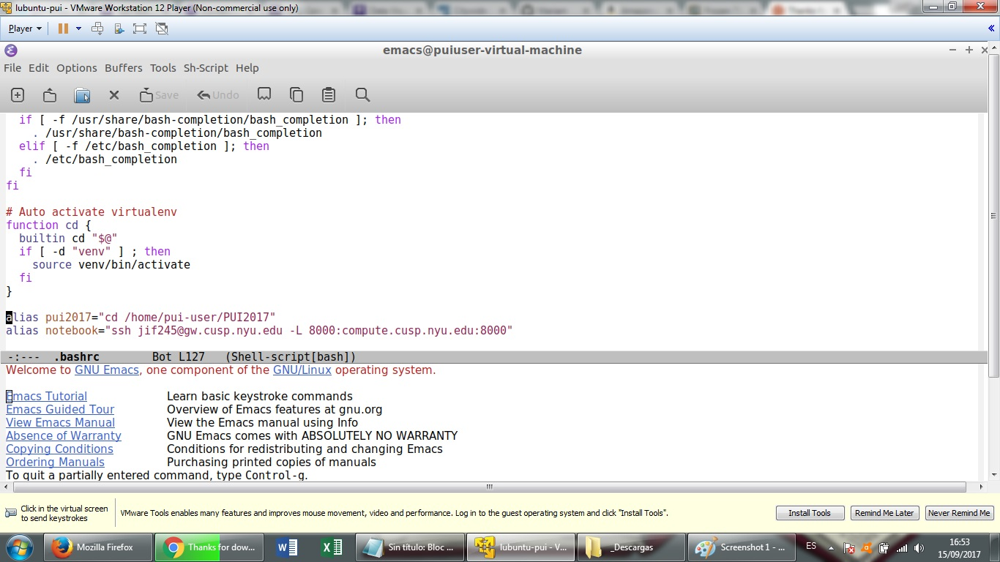
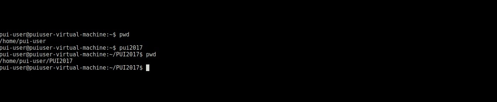

# PUI2017_jif245
This is a file I modified locally with emacs for Homework 2.

First I added an alias to the bash file in linux, like so:

This alias (pui2017) makes it easier to access the git folder that I'm going to use.

After that, I close the terminal and open it again to check the bash file was correctly configured with the alias:

Note: I had to uploaded like three times. First I changed the names of the files because I had "jpg" images with spaces in their names (e.g. "bash screen") and I was having problems to make the rmd load them.
After I fix that I noted that the screenshots were inverted, so I had to change the README.md file once again.
This is the third time I uploaded, hope it works.

Note2: Because the excercise specifies that the files have to be in a folder call "HW1_jif245" I had to move the work I had done to a new folder.
Since git is horrible and, to my knowledge, does not offer a way to move folder and files in a civilized manner, I had to move the readme file from github, and then modify this readme file locally for pushing it later.
To my surpise, git is so inconvenient that when you move a file, it erases it's history, so, the work I had done before of pushing changes is erased. Love you git.

Note3: there was an error in the file name extensions of the screenshots I had to re upload. So, one more push. 

