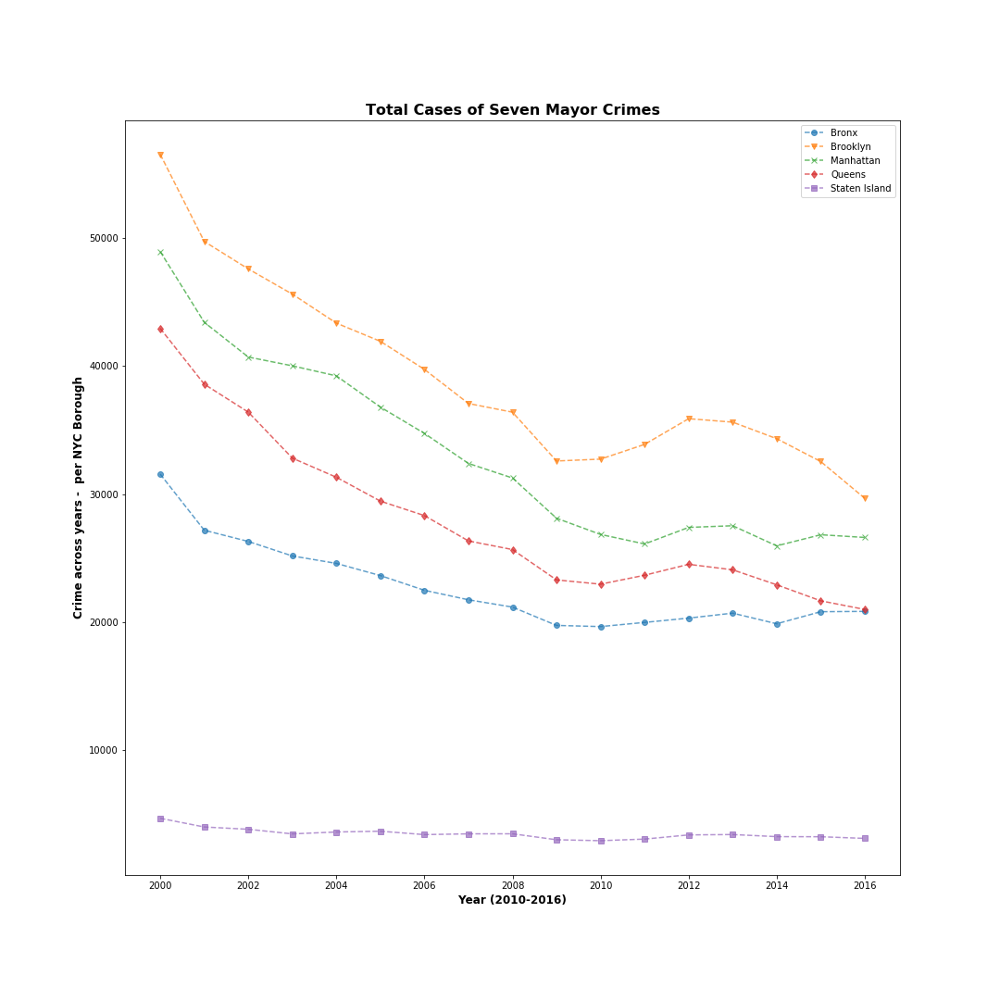

## HomeWork 8
Below are graphs of the variation in Seven Mayor Crimes (Murder, Rape, Robbery, Assault, Burglary, Larceny and Motor vehicle theft) in NYC, from 2000 to 2016. The data was acquired from NYPD (http://www1.nyc.gov/site/nypd/stats/crime-statistics/borough-and-precinct-crime-stats.page)

**Figure 1.** Absolute number of crimes per borough. Note that in this visualization Staten Island doesn't seem to have any improvement. The rest of the boroughs show a similar pattern. 

**Figure 2.** Ratio of crime per year compared to 2000. The first year is considered 1.0 and the following years are presented as a ratio of the first year. Note that now Staten Island shows a similar pattern to other boroughs. The five boroughs experiment a reduction in the seven mayor crimes, although some boroughs (Manhattan, Brooklyn and Queens) end with a greater reduction (50% reduction) than others (Bronx and Staten Island, 30% reduction). 

Note also that this graphs could have been done in Excel, but I did them in python. Overkill. 
