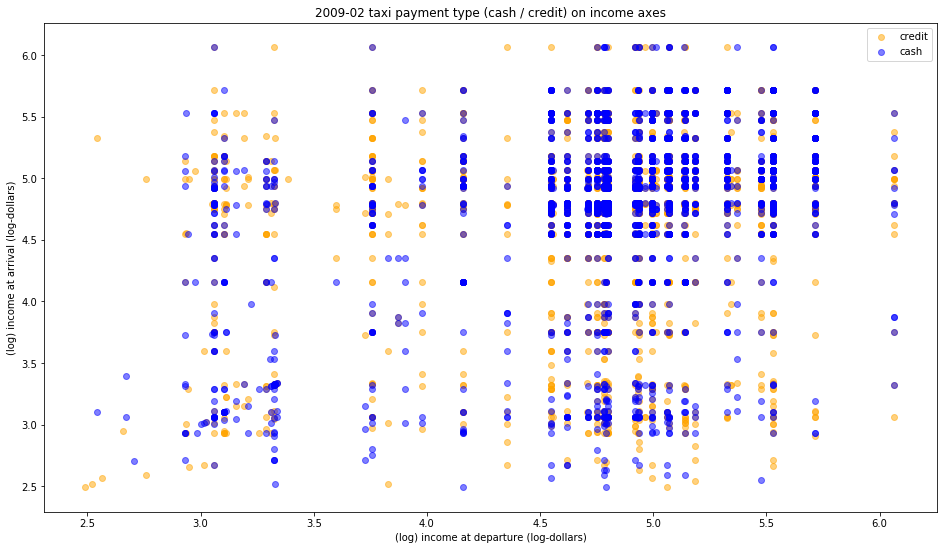

Review by Julián Ferreiro (jif245)

**CLARITY**

The graph requires careful reading of the caption to be able to interpet it. It also requires non-trivial technical knowledge about statistical and machine learning models to be able to appreciate it, making the graph less attractive for the layman. 
The pattern I'm extracting from the graph is that there are more trips from higher income areas than from lower income areas. It is just an impression, but the caption doesn't mention anything about this. In any case, I feel the caption and the graph are sending conflicting messages.

**AESTHETHIC**

The color choice is really good. They are very easy to distinguish and the graph is pleasant to look at. 
Maybe subsampling the dataset would have been helpfull to show less superimposition. 

**HONESTY**

From what I understand, the caption mentions the sample was sub-sampled to correct for the difference in proportions between credit and cash. This gives me the impression that the graph doesn't represent the data as it is. 
Although it is mentioned in the captions that the models are not finding any pattern, this is not something I can deduce from the graph itself, but from the text.
