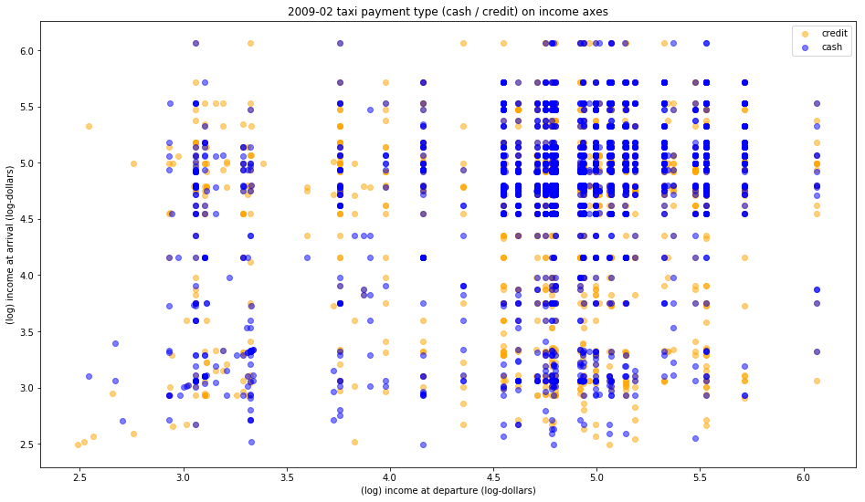

Review by Julián Ferreiro (jif245)

**CLARITY**  
The graph requires careful reading of the caption to be able to interpet it. It also requires non-trivial technical knowledge about statistical and machine learning models to be able to appreciate it, making the graph less attractive for the layman. 

# FBB why do you say it requires machine learning expertise? This is simply a scatter plot. If there were any obvious trends (similar arrival and destination income) it could be spotted. The issue is that there are no trands.

The pattern I'm extracting from the graph is that there are more trips from higher income areas than from lower income areas. It is just an impression, but the caption doesn't mention anything about this. In any case, I feel the caption and the graph are sending conflicting messages.

# FBB if you want to discuss the caption you should include the caption here!

**AESTHETHIC**  
The color choice is really good. They are very easy to distinguish and the graph is pleasant to look at. 
As a side note, maybe sampling the dataset to have a lower number of observations  would have been helpfull to show less superimposition. 

# FBB there is confusion in the plot. But it may be important to sample the space entirely. A better idea to decreaase the number of points though would be to aggregate in larger income bins

**HONESTY**  
From what I understand, the caption mentions the dataset was sub-sampled to correct for the difference in proportions between credit and cash. This gives me the impression that the graph doesn't represent the data as it is. 
# FBB fair point
Although it is mentioned in the captions that the models are not finding any pattern, this is not something I can deduce from the graph itself,
# FBB yes you can: the fact that your eyes are not drawn to any obvious pattern as you mention above is consistent with the models not finding patterns
but from the text. The real information is in the text, not in the graph.

# FBB The plot is rather misleading cause the same quantity is plotted on the x and y axis but the length of the axes is different. Thus would have a hard time identifying a 1-1 ratio, for example. Plots that show the same scale on x and y axis should be squared, or have a diagonal line to guide fair comparison

# FBB the labels are far far far too small!

9/10

