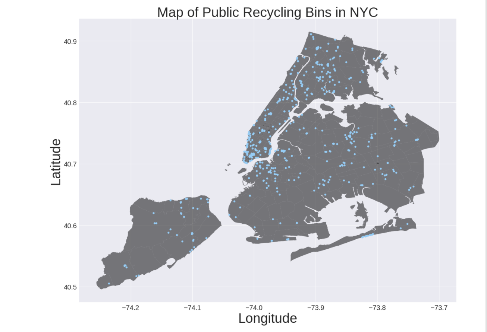

Review by Julián Ferreiro (jif245)

**CLARITY**  
The plot is straighforward to read: it has both a title and a caption that are clearly stating what is represented.
The axis of the plot are also correctly classified as latitude and longitude as it would be expected for a map.
Having plotted a single variable is easy to spot patterns, as stated in the caption, there are areas with higher concentration of recycling bins.
 
**AESTHETHIC**  
There is only one thing to focus on, as clearly stated in the title and is very easily identifiable: the bins. The color palette works with all the colorblind filters I tried, it's so good even a dog could understand the graph, good choice of colors.
There isn't extra clutter in the graph that could move away the attention from what is intended to represent.

**HONESTY**  
The only "negative" side of this plot is that is representing bins without normalizing for population density. It could give the impression that some areas are benefited by having more recycling bins, and probably this is not the case. A "recycling bin density by 100,000 habitants" for example, could be an extra graph to add and analyze in conjunction with the present graph.
