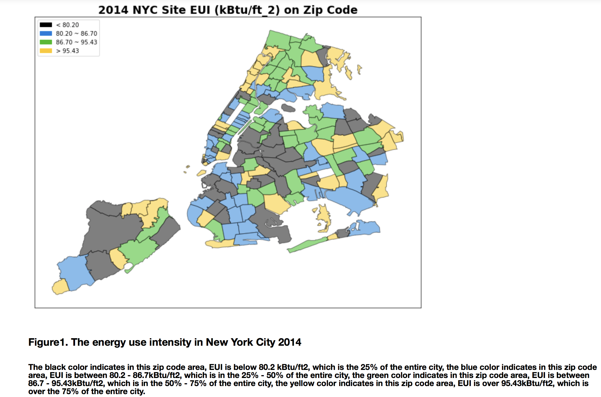

Review by Julián Ferreiro (jif245)

**CLARITY**
Although it is clear the graph is showing that different parts of NY have different energy intensities, it is not clear what the units mean or how much more energy each category represents compared to the others. It would have been nice some type of normalization or quantiles for the scale. 

The caption mentions the percentage each category is covering. It describes for example, that category yellow “is over the 75% of the city”. It sounds a little confusing, like it means the 75% of NYC area is yellow category. 
From looking at the graph I understand it means that each category represents each a quarter of the city. In any case, it feels like the information from the graph and the caption is conflicting. 
 
**ESTHETHIC**
The colors are chosen appropiately, with a colorblind tool they still look readable, although in this case, the caption would be more difficult to understand. Anyway, I think is also a pleasing choise of colors.

**HONESTY**
The Energy Use intensity seems to be strongly correlating to population density. The graph is implicating some areas consume more energy, but maybe people in the use in that area is efficient. Some tipe of normalization accounting for population density would have been useful to control for this. 
