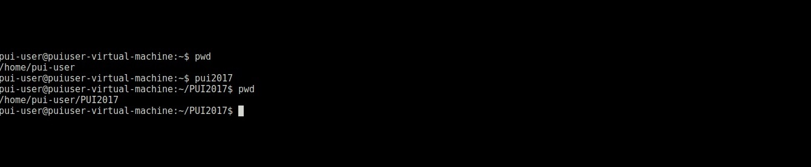
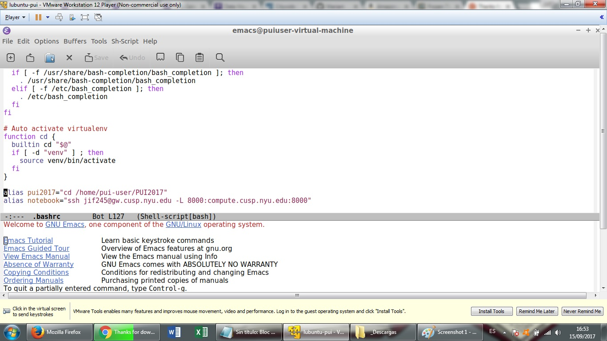

# PUI2017_jif245
This is a file I modified locally with emacs for Homework 2.

First I added an alias to the bash file in linux, like so:

This alias (pui2017) makes it easier to access the git folder that I'm going to use.

After that, I close the terminal and open it again to check the bash file was correctly configured with the alias:

